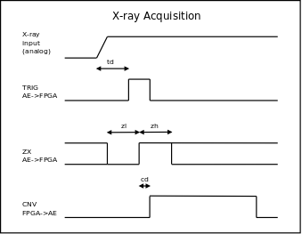

# Queri FPGA ICD
Draft of May 14, 2025

John P. Doty, Noqsi Aerospace Ltd
##  Signals and Voltages

### Digital Interface Signals to Analog Electronics (AE)

#### Per-detector signals (two of each)

These are all 3.3V CMOS. Positive logic except **SYNC/**.

* **FTRIG** (AE->FPGA) A pulse has risen above the fast threshold.
* **FZX** (AE->FPGA) After **FTRIG** has been asserted, a rising edge of **FZX** occurs at the moment that the filtered pulse amplitude peaks. This is when the ADC acquisition cycle should start. **FZX** will usually be in an indeterminate state, but will go low at or before the time that **FTRIG** is asserted. The rising edge of **FZX** will occur at or after the trailing edge of **FTRIG**.
* **FCNV** (FPGA->AE) Initiates A/D conversion. The rise of this should asynchronously follow the rise of **FZX** following assertion of **FTRIG**. The fall of **FCNV** initiates ADC readout, and should be synchronized with **SCK**. The **FCNV** pulse should be at least 500ns wide.
* **FSDO** (AE->FPGA) ADC data bits. See Figure 28 of the AD7984 data sheet for acquisition timing.

**STRIG**, **SZX**, **SCNV**, and **SSDO** are functionally the same as the above signals, but serve the slow chain.

* **SCK** (FPGA->AE) ADC clock.
* **OVER** (AE->FPGA) Diagnoses analog overload.
* **FULL** (AE->FPGA) This indicates that the charge integrator in the detector is (nearly) full. The FPGA state machine should issue a **DUMP** pulse. Recording such events is useful for measuring total detector current, radiation plus dark leakage.
* **DUMP** (FPGA->AE) Dump the charge from the SDD's charge integrator. 5 µs, 3.3V pulse.

#### Housekeeping

#### Operating Parameter Control

#### Master clock

#### PPS and Spacewire

## Event Logic and Timing

Event acquisition potentially involves three separate but related activities for an event from a given detector.

1. Acquisition of a pulse height from the fast chain.
2. Acquisition of a pulse height from the slow chain.
3. Detector charge dump.

### Pulse Height Acquisition

Defining *tp* as the peaking time of the chain, 60 ns for the fast chain, 2 µs for the slow chain (TBR), we have the following relationships.

The trigger delay *td*, and the zero-crossing delay *zd* should obey:

0 < *td* < *tp*

0 < *zd* < *tp*

The zero-crossing signal **ZX** is valid for a time *zl* ≈ *tp* before its low to high transition, and *zh* ≈ *tp* after. Outside this interval, it is unpredictable.

The conversion delay *cd* should be minimized. Its estimated value for the FPGA implementation affects the fine tuning of fast shaper time constants.

This timing comes from analog functions driven by photon arrival time, so it is all asynchronous. Once conversion is initiated by a low to high, the acquisition of ADC data may proceed synchronously in accordance with the ADC7984 specification.

### Charge Dump

The detector accumulates charge from dark current, optical loading, particle background, and x-rays. The **FULL** flag indicates accumulation nearing the limit of the detector's capacity to store it. If an x-ray pushes the charge above threshold, it is desirable to acquire that x-ray pulse height before dumping the charge. The **DUMP** pulse should be delayed by an amount *tdd* to allow the acquisition, where:

*tdd* > *tp(slow)*

to insure that the slow channel has the opportunity to trigger. If an x-ray trigger occurs, the delay should be extended to avoid interfering with acquisition.

### Races and Dead Time
An event potentially consists of three sub-events:

1. A pulse from the fast channel.
2. A pulse from the slow channel.
3. A detector charge dump.

Data acqusition depends on which signal initiates it, **FTRIG**, **STRIG**, or **FULL**.

#### Fast-triggered Events

If **FTRIG** is the first of the signals asserted, unconditionally acquire a pulse height from the fast channel. If **STRIG** occurs within 1.5×*tp(slow)* (3ns, TBR), aquire a pulse height from the slow channel, too. Otherwise, do not acquire a pulse height from the slow channel. Dead time starts when **FTRIG** is asserted.

\***Change**\* 20250514

The time tag is the time of the rising edge of **FZX**.

#### Slow-triggered Events

If **STRIG** is the first of the signals asserted, unconditionally acquire a pulse height from the slow channel. Do not acqure a pulse height from the fast channel. Dead time starts when **STRIG** is asserted.

\***Change**\* 20250514

The time tag is the time of the rising edge of **SZX**.

#### Full-triggered Events

If **Full** is the first of the signals asserted, wait 1.5×*tp(slow)*. If during this time, either **FTRIG** or **STRIG** is asserted, treat the event as fast-triggered or slow-triggered as appropriate. Otherwise, collect neither a fast nor slow pulse height, and proceed with a dump cycle. In that case, dead time starts when **DUMP** is asserted.

\***Change**\* 20250514

The time tag is when **DUMP** is asserted unless there is also a fast or slow trigger, in which case it is the time of the appropriate **ZX**.

#### Dump cycle

Once either **SCNV** is asserted, or it has been determined that no **SCNV** will be asserted for this event, a dump cycle is allowed. If **FULL** is asserted, assert **DUMP** for 5µs (TBR). Dead time continues during this interval.

\***Change**\* 20250508

When the dump pulse is asserted, pause acquisition for 15µs (TBR). Record this as the dead time.

#### Forced Trigger Cycle

Periodically (5/second, TBR) acquire a reference pulse height from both channels. This should occur when no event acquisition is in progress for the detector. Dead time starts when **FCNV** and **SCNV** are asserted.

\***Change**\* 20250514

The time tag is when **FCONV** and **SCONV** are asserted.

#### End of Acquisition

Event acquisition ends when:

1. **FCNV**, **SCNV**, and **DUMP** are not asserted, and
2. **FTRIG** and **STRIG** have been deaserted for 2×*tp(slow)* (4µs, TBR), and
3. \***Change**\* 20250508 **DUMP** has been deasserted for 15µs (TBR).

Dead time ends at this point.

## Data Encoding

Use the NICER MPU Photon Data Structure, with one exception: replace the "Undershoot" flag with a "Dump" flag, indicating that **DUMP** was issued during the event processing. 
### Pulse Height
The AD7984 ADC is an 18 bit, two's complement device, but pulse heights in telemetry are unsigned 12 bit quantities. The conversion is handled in 16 bit arithmetic as follows:

1. Acquire 16 bits from the ADC. Ignore the two least significant bits.
2. Complement the most significant bit, to obtain unsigned coding.
3. Subtract a 16 bit fixed offset.
4. Shift left 0-4 bits with limiting: if any of the lost bits is 1, yield 0xffff.
5. Drop the last 4 bits, for a 12 bit result.

The offset and shift parameters for each ADC are commandable.
